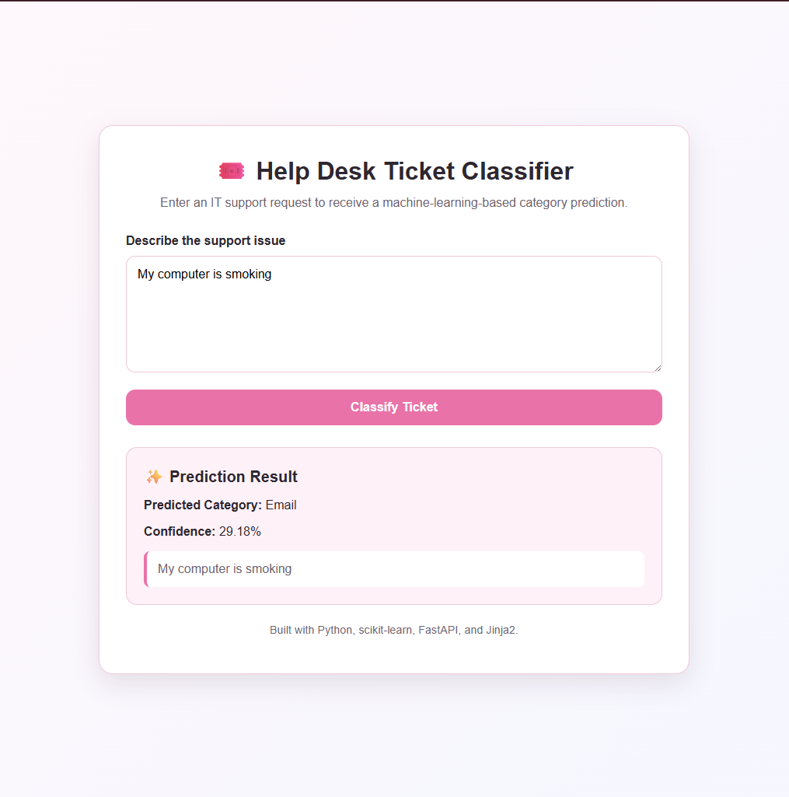

# 🎟️ ML-Powered Help Desk Ticket Classification System

A Python-based machine learning application that categorizes IT help desk tickets from written descriptions. Built with scikit-learn and FastAPI, it demonstrates how automated ticket triage can support faster routing and issue resolution.

## 💡 Why This Exists

IT support teams often receive large volumes of tickets that must be manually reviewed and routed to the correct category or team. This project demonstrates how machine learning can classify ticket descriptions automatically, helping reduce manual triage time and support faster issue resolution.

## 🔎 Project Overview

This project processes help desk ticket text and predicts the most appropriate ticket category using a trained machine learning model.

The training pipeline also creates a separate priority-classification model. The current FastAPI web application focuses on ticket-category prediction and displays a confidence score for each result.

## ✨ Features

- Ticket-category prediction using a trained machine learning model
- TF-IDF text preprocessing for ticket descriptions
- Logistic Regression classification with scikit-learn
- FastAPI web interface for submitting ticket descriptions
- Jinja2 templates for rendering prediction results in the browser
- Confidence-score display for each prediction
- Separate priority-classification model prepared for future application support
- Command-line prediction script for testing individual ticket descriptions

## 🛠️ Technologies Used

- **Python**: Core application and machine learning logic
- **pandas**: Dataset loading and preprocessing
- **scikit-learn**: TF-IDF vectorization, Logistic Regression, training, and evaluation
- **joblib**: Saving and loading trained machine learning models
- **FastAPI**: Web application framework and request handling
- **Jinja2**: Rendering the HTML interface and displaying model predictions
- **Uvicorn**: ASGI server used to run the FastAPI application

## ⚙️ How It Works

1. Ticket descriptions are loaded from a help desk dataset.
2. The text is transformed using TF-IDF vectorization.
3. A Logistic Regression model is trained to predict ticket categories.
4. A second model is trained to predict ticket priority.
5. The trained models are saved with `joblib`.
6. The FastAPI app loads the ticket-category model.
7. A user submits a ticket description through the browser interface.
8. The application returns the predicted category and a confidence score.

## 📊 Model Results

The category classifier achieved **100% accuracy on the project’s held-out test split**.

The priority classifier achieved **50% accuracy**, which reflects the challenge of predicting urgency from ticket text alone. Ticket priority often depends on business impact, outage scope, user role, and other context not included in a short written request.

> This project is intended as a portfolio demonstration of machine-learning-assisted ticket triage, not a production-ready help desk routing system.

## 🖥️ Application Preview

The FastAPI web interface accepts a help desk ticket description and returns a predicted category with a confidence score.



## 🌸 Future Improvements
- Expand the web app to display both category and priority predictions
- Add model evaluation results and accuracy metrics
- Improve dataset size and class balance
- Add a more polished user interface
- Deploy the application as a hosted web service
- Improve low-confidence predictions by expanding the dataset with more varied ticket wording
- Add a confidence threshold so uncertain predictions can be flagged for manual review
- Add priority prediction to the web interface

## 👩🏽‍💻 Author

Jada Carter
IT Support Specialist | M.S. AI Engineering
Interested in cloud, automation, identity and access management, and practical AI solutions.

[Connect with me on LinkedIn](https://www.linkedin.com/in/jada-carter-284a101b4/)

## 📁 Current Project Structure

```text
ticket-classification-system-pink/
│
├── main.py                              # FastAPI web application
├── train_model.py                       # Data preprocessing and model training
├── predict.py                           # Command-line ticket category prediction
├── helpdesk_tickets_dataset.csv         # Original ticket dataset
├── helpdesk_tickets_dataset_v2.csv      # Updated ticket dataset
└── README.md                            # Project documentation

